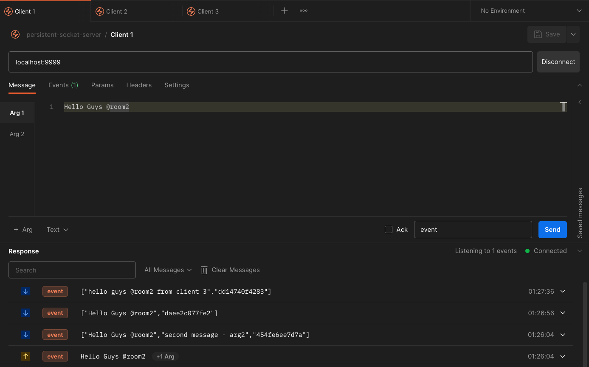

## Persistent Socker Server

A simple socket.io server that persists connections to a redis store. This is useful for when you want to have a socket.io server that can be scaled horizontally

### Running Locally

```bash
docker compose build
```

```bash
docker compose up -d
```

### Test the connection through POSTMAN



[Postman Collection](https://www.postman.com/nil1729/workspace/nil1729-api-collection/collection/65a58ba89fb0f43333040d7a?action=share&creator=11092187)

---

Made with ❤️ by [nil1729](https://github.com/nil1729)
